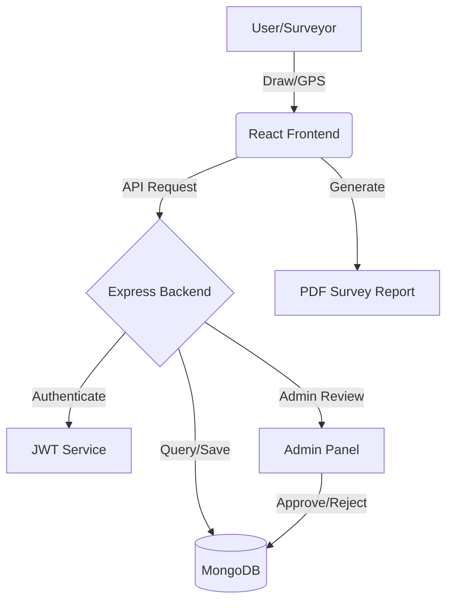

# 🌍 Smart Land Measurement & Survey System (SLMSS)


[](https://reactjs.org/)
[](https://nodejs.org/)
[](https://www.mongodb.com/)
[](https://tailwindcss.com/)

> **A Next-Generation GIS Solution** for professional land surveyors, farmers, and government authorities. Measure, track, and verify land parcels with satellite precision.

---

## 🎯 Project Overview
The **Smart Land Measurement & Survey System** is a full-stack MERN application that bridge the gap between traditional land surveying and modern GIS technology. It allows users to map irregular land shapes directly on interactive satellite maps or via live GPS tracking during field walks.

## 🚀 Key Features

### 📍 1. Advanced Map Integration
*   **Interactive Polygons**: Draw precise boundaries with high-resolution satellite imagery.
*   **Layer Switching**: Seamlessly toggle between **Normal**, **Satellite**, and **Hybrid** views.
*   **Real-time HUD**: View area and perimeter updates live as you move markers.

### 📏 2. Precision Measurement Engine
*   **Multi-Unit Support**: Instant conversion between **Sq.Ft, Sq.Meters, Acres, and Hectares**.
*   **GIS Formulas**: Uses the **Spherical Polygon Area** and **Haversine** formulas for real-world accuracy.
*   **Irregular Shapes**: Full support for complex, multi-vertex land parcels.

### 📡 3. Smart GPS Survey Mode
*   **Walk-through Mapping**: Capture boundaries by walking around the field with a mobile device.
*   **Auto-Polygon Generation**: Points are automatically connected to form a surveyed plot.
*   **Live Tracking**: High-accuracy geolocation capture for official records.

### 👤 4. Role-Based Governance (RBAC)
*   **Surveyor Dashboard**: Manage your personal measurement history, edit plots, and track approvals.
*   **Admin Verification**: Government-level verification panel to **Approve** or **Reject** land records.
*   **System Analytics**: Real-time stats on total land measured, active surveyors, and approval rates.

### 📄 5. Official Reporting & AI
*   **PDF Export**: Generate professional survey reports with map snapshots and coordinate logs.
*   **AI Insights**: Smart crop suitability suggestions based on geographical data and area size.

---

## 🛠️ Tech Stack

| Layer | Technology |
| :--- | :--- |
| **Frontend** | React.js (Vite), Tailwind CSS, Leaflet.js, Framer Motion |
| **Backend** | Node.js, Express.js |
| **Database** | MongoDB (Mongoose) |
| **Auth** | JWT (JSON Web Tokens), Bcrypt.js |
| **Utilities** | Geolib, jsPDF, html2canvas, Multer |

---

## 📦 Installation & Setup

### 1. Clone & Initialize
```bash
git clone https://github.com/your-repo/smart-land-survey.git
cd smart-land-survey
```

### 2. Backend Configuration
1.  Navigate to `backend` folder: `cd backend`
2.  Install dependencies: `npm install`
3.  Create a `.env` file:
    ```env
    PORT=5000
    MONGODB_URI=your_mongodb_uri
    JWT_SECRET=your_jwt_secret
    ```
4.  Start server: `npm start`

### 3. Frontend Configuration
1.  Navigate to `frontend` folder: `cd ../frontend`
2.  Install dependencies: `npm install`
3.  Create a `.env` file:
    ```env
    VITE_API_URL=http://localhost:5000/api
    VITE_GOOGLE_MAPS_API_KEY=your_key
    ```
4.  Start development server: `npm run dev`

---

## 📐 System Architecture


## 🛡️ Default User Roles
- **Surveyor**: Register and select "Land Surveyor" role.
- **Administrator**: Register and select "Administrator" role to access the verify panel.

## 📜 License
Distributed under the MIT License. See `LICENSE` for more information.


**Developed with ❤️ for the Future of Agriculture & Urban Planning.**
<div align="center">
  <p>Made with ❤️ by Bhaumik Kothiya</p>
</div>
