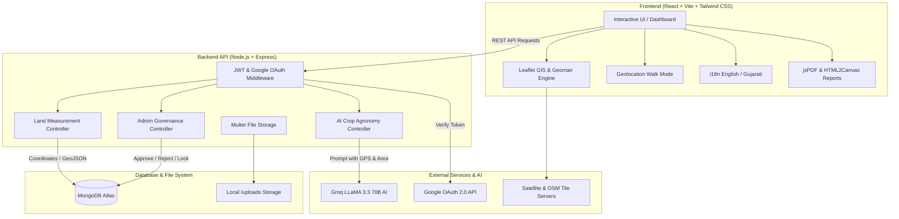

# 🌍 Smart Land Measurement & Survey System (SLMSS)

<div align="center">


### 🌾 Precision GIS Land Measurement, Real-Time GPS Tracking, AI Agronomy & Governance Platform

[](https://reactjs.org/)
[](https://vitejs.dev/)
[](https://nodejs.org/)
[](https://expressjs.com/)
[](https://www.mongodb.com/)
[](https://tailwindcss.com/)
[](https://groq.com/)
[](https://opensource.org/licenses/MIT)

</div>

---

## 📖 Table of Contents
- [📌 Overview](#-overview)
- [✨ Key Features](#-key-features)
- [🏗️ System Architecture](#️-system-architecture)
- [🛠️ Tech Stack](#️-tech-stack)
- [📂 Project Structure](#-project-structure)
- [⚡ Quick Start & Installation](#-quick-start--installation)
  - [Prerequisites](#prerequisites)
  - [Backend Setup](#1-backend-setup)
  - [Frontend Setup](#2-frontend-setup)
- [🔐 Environment Variables](#-environment-variables)
- [🔌 API Reference](#-api-reference)
- [👥 Role-Based Access & Governance](#-role-based-access--governance)
- [🌐 Multi-Language Support (i18n)](#-multi-language-support-i18n)
- [📜 License & Credits](#-license--credits)

---

## 📌 Overview

The **Smart Land Measurement & Survey System (SLMSS)** is an end-to-end full-stack MERN & GIS platform designed for **Land Surveyors, Agriculturalists, Landowners, and Government Administrators**.

It modernizes traditional land surveying by providing:
- 🛰️ **Interactive High-Resolution Satellite Mapping** with polygon drawing and editing tools.
- 🚶 **Live Mobile GPS Walk-Through Surveying** for on-field boundary capturing.
- 🤖 **AI-Driven Crop & Agricultural Recommendations** powered by Groq LLaMA 3.3 70B based on real GPS coordinates.
- 📋 **Official PDF Survey Reports & QR Code Verifications**.
- 🏛️ **Government Verification & Admin Governance Panel** for plot record approvals and user management.
- 🌐 **Bilingual Interface** supporting English and Gujarati.

---

## ✨ Key Features

### 📍 1. Advanced GIS & Interactive Satellite Mapping
- **Polygon Drawing Tools:** Create, edit, drag, and delete multi-vertex boundary plots seamlessly using Leaflet & Leaflet-Geoman.
- **Layer Switcher:** Toggle between **Satellite Imagery**, **OpenStreetMap Standard**, and **Hybrid Views**.
- **Real-Time HUD:** Dynamic real-time calculation of area and perimeter as boundary points are adjusted.

### 📐 2. Precision Area & Coordinate Engine
- **Geodesic Accuracy:** Uses spherical polygon algorithms and the **Haversine formula** for geodesic real-world measurement.
- **Multi-Unit Instant Conversion:** Converts dynamically between:
  - **Square Feet (Sq. Ft)**
  - **Square Meters (Sq. M)**
  - **Acres**
  - **Hectares**
- **Support for Irregular Land Shapes:** Handles complex non-standard parcels with precision.

### 📡 3. Live GPS Walk-Through Survey Mode
- **Mobile Field Walking:** Surveyors can walk along land perimeters while the device captures real-time high-accuracy geolocation points.
- **Auto-Polygon Synthesis:** Automatically connects GPS breadcrumbs into completed land parcels.

### 🤖 4. AI-Powered Smart Agriculture Insights
- **Micro-Location Soil & Climate Analysis:** Uses the **Groq LLaMA 3.3 70B** model to analyze coordinates, parcel size, and regional climate patterns.
- **Crop Suitability Ratings:** Generates suitability scores (0-100%) and personalized agronomic reasons for cash crops, grains, and legumes.

### 📄 5. Official Survey Reports & QR Code Verification
- **Automated PDF Generation:** Exports tamper-evident survey reports with map captures, GPS coordinate logs, surveyor details, and timestamps.
- **QR Code Authentication:** Instant scannable QR code on survey reports for digital verification of land records.
- **Document Attachments:** Upload and manage land registry deeds, blueprints, and ownership documents via Multer.

### 🛡️ 6. Role-Based Governance & Admin Portal
- **Surveyor Dashboard:** Manage measurement records, upload documents, track review status (**Pending / Approved / Rejected**).
- **Admin Verification Panel:** Government-grade verification dashboard to review, approve, or reject land parcel records.
- **User Management & Security:** Admin controls to inspect users, lock/unlock accounts, and view global statistics.
- **Google OAuth 2.0 & JWT Security:** One-click Google sign-in alongside secure email/password authentication.

### 🌐 7. Multi-Language Support (i18n)
- Seamless bilingual toggle between **English** and **Gujarati (ગુજરાતી)** with instant UI state persistence.

---

## 🏗️ System Architecture



---

## 🛠️ Tech Stack

### Frontend
- **Framework:** [React 18](https://react.dev/) + [Vite](https://vitejs.dev/)
- **Styling:** [Tailwind CSS](https://tailwindcss.com/), [Material UI (MUI)](https://mui.com/), [Framer Motion](https://www.framer.com/motion/)
- **GIS & Maps:** [Leaflet](https://leafletjs.com/), [React Leaflet](https://react-leaflet.js.org/), [@geoman-io/leaflet-geoman-free](https://geoman.io/), `leaflet-draw`
- **Geolocation & Math:** [Geolib](https://github.com/manuelbieh/geolib)
- **Internationalization:** [i18next](https://www.i18next.com/) & `react-i18next`
- **PDF & QR Code:** `jspdf`, `html2canvas`, `qrcode.react`
- **Icons & Notifications:** `lucide-react`, `react-hot-toast`
- **Authentication Client:** `@react-oauth/google`

### Backend
- **Runtime & Framework:** [Node.js](https://nodejs.org/) & [Express 5](https://expressjs.com/)
- **Database:** [MongoDB](https://www.mongodb.com/) with [Mongoose](https://mongoosejs.com/)
- **AI Engine:** [Groq Cloud](https://groq.com/) with `llama-3.3-70b-versatile`
- **Authentication & Security:** JWT (`jsonwebtoken`), `bcryptjs`, `google-auth-library`, CORS
- **File Uploads:** [Multer](https://github.com/expressjs/multer)
- **PDF Toolkit:** `pdfkit`

---

## 📂 Project Structure

```text
Land-Measurement-System/
├── backend/
│   ├── middleware/
│   │   └── auth.js            # JWT verification & admin role guards
│   ├── models/
│   │   ├── LandRecord.js      # Land parcel schema, coordinates & docs
│   │   └── User.js            # User accounts, roles, lock flags & bcrypt hashing
│   ├── routes/
│   │   ├── adminRoutes.js     # Admin verification, user management & analytics
│   │   ├── aiRoutes.js        # Groq LLaMA 3.3 crop recommendation API
│   │   ├── authRoutes.js      # Register, Login & Google OAuth
│   │   └── landRoutes.js      # CRUD operations for land plots & public stats
│   ├── uploads/               # Survey attachments & document storage
│   ├── .env                   # Backend environment configuration
│   ├── package.json           # Backend dependencies and scripts
│   └── server.js              # Express app entrypoint & database connection
├── frontend/
│   ├── public/                # Static assets & icons
│   ├── src/
│   │   ├── api/               # Axios client instances and API endpoints
│   │   ├── assets/            # UI images, logos, and graphics
│   │   ├── components/        # Reusable UI components (Navbar, Footer, Modal, etc.)
│   │   ├── context/           # React Context (AuthContext)
│   │   ├── pages/             # App pages:
│   │   │   ├── Home.jsx           # Landing page with live public statistics
│   │   │   ├── MeasureLand.jsx    # Interactive map drawing & GPS live walk mode
│   │   │   ├── Dashboard.jsx      # Surveyor measurement records list
│   │   │   ├── LandDetails.jsx    # Plot inspector, AI insights, PDF & QR export
│   │   │   ├── AdminDashboard.jsx # Admin approval panel & user management
│   │   │   ├── Login.jsx          # User login & Google OAuth
│   │   │   ├── Register.jsx       # User registration
│   │   │   ├── About.jsx          # Mission, vision, core values
│   │   │   └── Privacy.jsx        # Privacy policy & terms
│   │   ├── utils/             # Calculation helpers & geometry utilities
│   │   ├── i18n.js            # English and Gujarati localization dictionaries
│   │   ├── App.jsx            # App routing and route guards
│   │   ├── index.css          # Tailwind CSS styles
│   │   └── main.jsx           # React DOM root
│   ├── .env                   # Frontend environment configuration
│   ├── package.json           # Frontend dependencies and scripts
│   ├── tailwind.config.js     # Tailwind CSS configuration
│   └── vite.config.js         # Vite configuration
└── README.md                  # Project documentation
```

---

## ⚡ Quick Start & Installation

### Prerequisites
- [Node.js](https://nodejs.org/) (v18 or higher recommended)
- [MongoDB](https://www.mongodb.com/) (Local instance or MongoDB Atlas URI)
- [Git](https://git-scm.com/)

---

### 1. Backend Setup

1. Open your terminal and navigate to the backend directory:
   ```bash
   cd backend
   ```

2. Install dependencies:
   ```bash
   npm install
   ```

3. Create a `.env` file in the `backend/` directory:
   ```env
   PORT=5000
   NODE_ENV=development
   MONGODB_URI=your_mongodb_connection_string
   JWT_SECRET=your_jwt_secret_key
   GOOGLE_CLIENT_ID=your_google_client_id.apps.googleusercontent.com
   GROQ_API_KEY=your_groq_api_key
   ```

4. Start the backend development server:
   ```bash
   npm run dev
   # or
   npm start
   ```
   *The server will run on `http://localhost:5000`.*

---

### 2. Frontend Setup

1. Open a new terminal and navigate to the frontend directory:
   ```bash
   cd frontend
   ```

2. Install dependencies:
   ```bash
   npm install
   ```

3. Create a `.env` file in the `frontend/` directory:
   ```env
   VITE_API_URL=http://localhost:5000/api
   VITE_GOOGLE_CLIENT_ID=your_google_client_id.apps.googleusercontent.com
   ```

4. Start the Vite development server:
   ```bash
   npm run dev
   ```
   *The web application will launch on `http://localhost:5173`.*

---

## 🔐 Environment Variables

### Backend (`backend/.env`)
| Variable | Description | Required |
| :--- | :--- | :---: |
| `PORT` | Port number for Express server (default: `5000`) | Yes |
| `MONGODB_URI` | MongoDB Atlas / Local MongoDB connection string | Yes |
| `JWT_SECRET` | Secret key for signing JSON Web Tokens | Yes |
| `GOOGLE_CLIENT_ID` | OAuth 2.0 Client ID for Google authentication | Yes |
| `GROQ_API_KEY` | API Key for Groq Cloud (LLaMA 3.3 70B AI inference) | Yes |

### Frontend (`frontend/.env`)
| Variable | Description | Required |
| :--- | :--- | :---: |
| `VITE_API_URL` | Base URL of the backend API (e.g. `http://localhost:5000/api`) | Yes |
| `VITE_GOOGLE_CLIENT_ID` | Google OAuth 2.0 Web Client ID | Yes |

---

## 🔌 API Reference

### 🔑 Authentication (`/api/auth`)
| Method | Endpoint | Description | Access |
| :--- | :--- | :--- | :--- |
| `POST` | `/api/auth/register` | Register a new user | Public |
| `POST` | `/api/auth/login` | Email & password login | Public |
| `POST` | `/api/auth/google` | Google OAuth 2.0 login / register | Public |

### 🌾 Land Measurement Records (`/api/land`)
| Method | Endpoint | Description | Access |
| :--- | :--- | :--- | :--- |
| `GET` | `/api/land/public-stats` | Get landing page public metrics | Public |
| `POST` | `/api/land/` | Create a new plot measurement (with files) | Private (User/Admin) |
| `GET` | `/api/land/my-lands` | Get all records of the logged-in user | Private (User) |
| `GET` | `/api/land/:id` | Get details of a single land record | Private (Owner/Admin) |
| `DELETE` | `/api/land/:id` | Delete a land record | Private (Owner/Admin) |

### 🤖 AI Agronomy Insights (`/api/ai`)
| Method | Endpoint | Description | Access |
| :--- | :--- | :--- | :--- |
| `POST` | `/api/ai/analyze-crops` | Get AI crop suggestions from GPS & area | Public / Authenticated |

### 🛡️ Admin & Governance (`/api/admin`)
| Method | Endpoint | Description | Access |
| :--- | :--- | :--- | :--- |
| `GET` | `/api/admin/lands` | Retrieve all system-wide land records | Admin Only |
| `PATCH` | `/api/admin/lands/:id/status` | Set status: `approved`, `rejected`, `pending` | Admin Only |
| `GET` | `/api/admin/analytics` | Get total counts, approval rate & area distribution | Admin Only |
| `GET` | `/api/admin/users` | List all registered surveyors | Admin Only |
| `DELETE` | `/api/admin/users/:id` | Delete user account | Admin Only |
| `PATCH` | `/api/admin/users/:id/lock` | Lock or unlock a user account | Admin Only |

---

## 👥 Role-Based Access & Governance

| Feature | Land Surveyor (`user`) | Administrator (`admin`) |
| :--- | :---: | :---: |
| Satellite & GPS Land Measurement | ✅ | ✅ |
| AI Crop Suitability Analysis | ✅ | ✅ |
| Export PDF Reports & QR Codes | ✅ | ✅ |
| Manage Personal Survey Records | ✅ | ✅ |
| Review & Approve / Reject Land Records | ❌ | ✅ |
| Access Global System Analytics | ❌ | ✅ |
| Manage & Lock/Unlock Surveyor Accounts | ❌ | ✅ |

---

## 🌐 Multi-Language Support (i18n)

The application includes built-in internationalization powered by `react-i18next`. Users can switch between:
- 🇬🇧 **English (en)**
- 🇮🇳 **Gujarati (gu - ગુજરાતી)**

Language choice is automatically remembered in browser `localStorage`.

---

## 📜 License & Credits

Distributed under the **MIT License**. See `LICENSE` for more information.

<div align="center">

**Developed with ❤️ for the Future of Agriculture, Land Surveying & Smart Governance.**

Made with ❤️ by **Bhaumik Kothiya**

</div>
